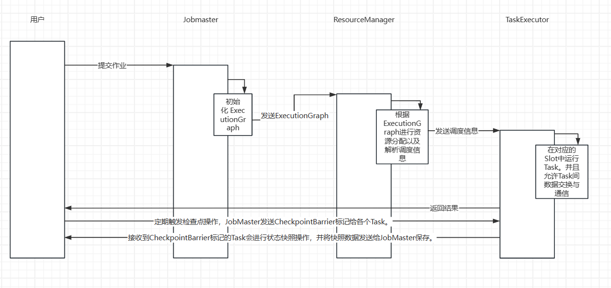

# Chapter 3
## 3.1Flink任务调度中重要的类关系
1. `JobGraph`和`ExecutionGraph`：  
   `JobGraph`是用户提交的作业图，定义于`flink-runtime/src/main/java/org/apache/flink/runtime/jobgraph/JobGraph.java`，包含作业的算子及其之间的依赖关系。  
   `ExecutionGraph`是根据`JobGraph`生成的执行图，定义于`flink-runtime/src/main/java/org/apache/flink/runtime/executiongraph/ExecutionGraph.java`，包含了作业的拓扑结构、算子的执行状态和调度信息。  
   `JobGraph`和`ExecutionGraph`之间是一对一的关系。  

2. `JobVertex`和`ExecutionVertex`：
   `JobVertex`表示作业中的一个算子，包括算子的名称、输入输出边等信息，定义于`flink-runtime/src/main/java/org/apache/flink/runtime/jobgraph/JobVertex.java`。  
   `ExecutionVertex`表示`ExecutionGraph`中的一个算子实例，包括算子的并行度、分配的资源槽等信息，定义于`flink-runtime/src/main/java/org/apache/flink/runtime/executiongraph/ExecutionVertex.java`。  
   一个`JobVertex`可以根据作业的并行度对应多个`ExecutionVertex`。  

3. `JobMaster`和`TaskExecutor`  
   `JobManager`是作业的主节点，负责接收和处理作业图（`JobGraph`），生成`ExecutionGraph`，并与`TaskExecutors`进行通信以协调和监控任务的执行。  
   `TaskExecutor`是作业的工作节点，负责执行具体的任务。  
   `TaskExecutor`与`JobMaster`进行通信以接收任务和上报状态。  

4. `CheckpointCoordinator`和`CheckpointBarrier`
   `CheckpointCoordinator`是负责管理检查点的组件，包括触发检查点、处理快照数据等操作，定义于`flink-runtime/src/main/java/org/apache/flink/runtime/checkpoint/CheckpointCoordinator.java`。  
   `CheckpointBarrier`是在数据流中插入的障碍，用于触发检查点操作，确保所有任务都达到一致的检查点位置。定义于`flink-runtime/src/main/java/org/apache/flink/runtime/io/network/api/CheckpointBarrier.java`。    
   一个`CheckpoinCoordinator`可以管理多个`CheckpointBarrier`，每个`Barrier`与其所属任务相关联。

## 3.2Flink任务调度核心设计中的时序图
因为Flink模块较多，画一幅详尽的时序图是不太可能的，即使画出来可读性也极差，所以我会画一个简略版的时序图：  
  
上述时序图展现了以下几个关键步骤和类之间的交互：  
1. 用户提交作业：
   1. 用户通过客户端向`JobMaster`提交作业。  
   2. `JobMaster`接收到作业后，开始进行初始化操作。  

2. 初始化 `ExecutionGraph`：  
   1. `JobMaster`根据用户提交的作业信息创建`ExecutionGraph`，包括作业的拓扑结构、算子的并行度等。  
   2. `ExecutionGraph`会被发送给`ResourceManager`以便后续的资源分配和任务调度。  

3. 调度作业：  
   1. `JobMaster`将`ExecutionGraph`中的调度信息发送给`ResourceManager`，包括每个`Task`所需的资源、位置等信息。  
   2. `ResourceManager`负责将这些调度信息传达给相应的`TaskExecutor`进行任务的分配和调度。  

4. 启动 `Task`：  
   1. `TaskExecutor`根据接收到的调度信息，在对应的资源槽（`Slot`）中启动`Task`来执行。  
   2. `Task`开始执行数据处理操作，与其他`Task`进行数据交换和通信。  

5. 执行任务和数据交换：  
   1. `TaskExecutor`中的`Task`执行具体的数据处理逻辑，并与其他`Task`进行数据交换和通信，例如通过网络将数据发送给其他`Task`。  

6. 检查点管理和恢复：  
   1. 定期触发检查点操作，`JobMaster`发送`CheckpointBarrier`标记给各个`Task`。  
   2. 接收到`CheckpointBarrier`标记的`Task`会进行状态快照操作，并将快照数据发送给`JobMaster`保存。  
   3. 在发生故障时，根据已保存的检查点数据，进行作业的恢复操作。  

