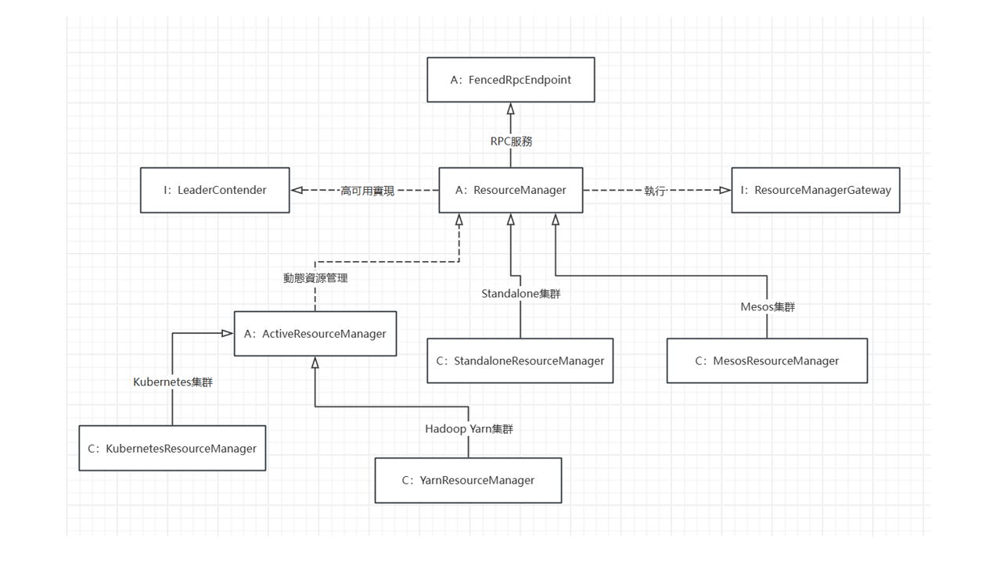
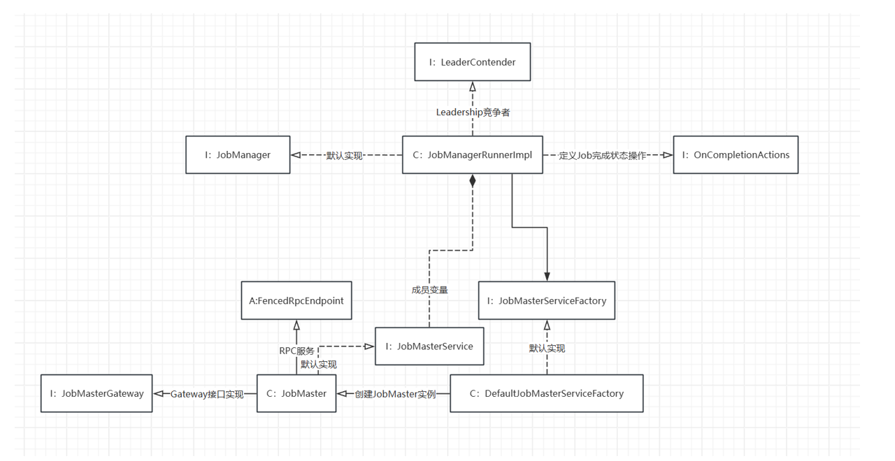

# Chapter 4

## 高级设计意图分析

本章节主要分析Flink中的设计思想与模式。
对象模型中拥有4个主要要素： 
1. 抽象
2. 封装
3. 模块化
4. 层次化结构

本节将从这4个角度以及设计模式来简析Flink的任务调度模块

### 抽象
任务调度模块主要抽象出多个调度组件协同工作： 
1. JobMaster负责Job的管理。当用户提交一个作业时，JobMaster会接收到作业的描述信息，并开始调度和执行作业。JobMaster 也维护了整个作业及其 Task 的状态，对外提供对作业状态的查询功能。
2. ResourceManager负责管理和分配资源。
3. Dispatcher主要实现集群中作业的收发处理。
4. TaskManager提供了作业运行过程中需要的Slot计算资源，JobManager中提交的Task实例都会运行在TaskManager组件上。
5. SchedulerNG是作业调度中最为核心的组件（调度器），他会管理作业执行的全部过程，例如JobGraph到ExecutionGraph的转换，作业生命周期的管理，资源的申请与释放等等。 

### 封装与模块化
Flink中将上述调度组件封装成一个个模块，SchedulerNG（调度器）在管理作业执行过程时，会使用ResourceManager等模块，但是其一般并不关心这些模块如何实现自己的功能。

### 层次化结构
Flink中大量使用了类继承，做到了面向父类和接口编程，而且也用到了组合。我们可以通过下面的简单类图看出这点： 
  
  

### 设计模式
#### 工厂模式
  **意图**：定义一个创建对象的接口，让其子类自己决定实例化哪一个工厂类，工厂模式使其创建过程延迟到子类进行。  
  **主要解决**：主要解决接口选择的问题。  
  **应用场景**：我们明确地计划不同条件下创建不同实例时。  
  **如何解决**：让其子类实现工厂接口，返回的也是一个抽象的产品。  
  Flink中大量地使用了工厂模式，例如Dispatcher中，使用了工厂类DispatcherFactory，可以让客户端通过工厂接口来获取对象，从而实现了面向接口编程。而且工厂类可以根据不同的参数或条件，选择合适的实现类或对象配置，并返回相应的实例。这样可以简化客户端的代码，使得客户端只需关注对象的使用而无需关心对象的创建细节。

  
#### 观察者模式
  **意图**：定义对象间的一种一对多的依赖关系，当一个对象的状态发生改变时，所有依赖于它的对象都得到通知并被自动更新。  
  **主要解决**：一个对象状态改变给其他对象通知的问题，而且要考虑到易用和低耦合，保证高度的协作。  
  **应用场景**：一个对象（目标对象）的状态发生改变，所有的依赖对象（观察者对象）都将得到通知，进行广播通知。  
  **如何解决**：使用面向对象技术，可以将这种依赖关系弱化。 
  Flink中存在着部分监听器（Listener）是观察者模式，例如JobStatusListener监听着Job的状态，当其被修改的时候，会通知相关的其他组件，更新各自的行为。
